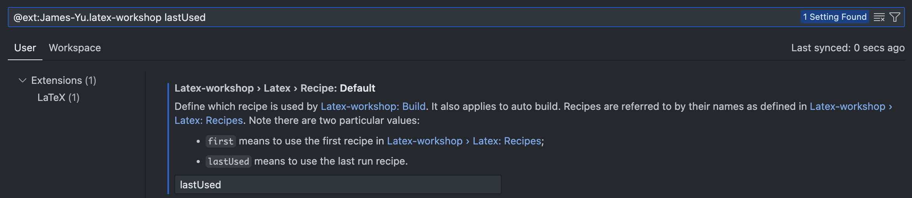

# Sample TeX Project Workflow

## Tools

+ [TexLive](https://www.tug.org/texlive/)
+ [VSCode](https://code.visualstudio.com/)
+ [LaTeX Workshop](https://marketplace.visualstudio.com/items?itemName=James-Yu.latex-workshop)

Optional LaTeX Workshop setting:

## Workflow

+ Write content in `tex` directory, split into multiple files based on chapters or sections, and include them with `\input{}` in `main.tex`.

+ VSCode LaTeX Workshop will compile tex files automatically on save. The generated PDF file can be previewed either in the VSCode side panel or in a browser.

+ Alternatively, the PDF file can be generated manually by running `make` using the `Makefile`, using the `latexmk` command.

+ Same as the workflow of software development, once `*.tex` files and corresponding figures are commited with `git`, and pushed to GitHub, the GitHub action workflow defined in [build.yaml](./.github/workflows/build.yaml) will be triggered automatically to compile the PDF file and upload it as an artifact. It ensures reproducibility and version control of not only code, but also the figures and tex files.

+ Once a major version is ready, i.e., ready for requesting for internal/external feedback, or submitted to revier, a release/tag can be created in GitHub, which also triggers the GitHub action workflow to compile the PDF file and upload it as an artifact in the release page.

+ Once feedback is received and major revisions are made, diff files can be generated using the `latexdiff` command in the `Makefile`.
